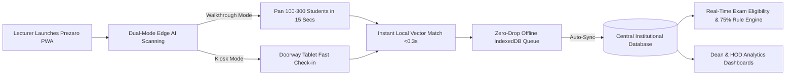

# 🎓 PREZARO — INSTITUTIONAL PLATFORM GUIDE & EXECUTIVE PITCH DECK

> **AI-Powered Edge Facial Recognition, Contactless Attendance & Academic Lecture Operations System**  
> *Engineered for Universities, Polytechnics, Colleges, and Professional Training Institutions.*

---

## Executive Summary

**Prezaro** is a next-generation academic operations and biometric attendance platform designed to eliminate the operational, pedagogical, and financial losses caused by legacy roll-call methods. 

By running state-of-the-art **Edge AI facial recognition** directly inside modern mobile and desktop web browsers (as an offline-first Progressive Web App), Prezaro delivers **instant, contactless, proxy-proof attendance** in seconds—without requiring expensive biometric hardware, specialized scanners, or dependable internet access in lecture halls.

---

## 1. The Institutional Crisis: The Cost of Legacy Attendance

Every semester, higher institutions lose thousands of instructional hours and compromise academic integrity through outdated attendance practices:

| The Problem | Traditional Reality | The Institutional Impact |
|---|---|---|
| **Instructional Time Theft** | Manual paper signing or call-outs consume 10–20 minutes of every 60–90 min lecture. | Up to **15–20% of paid instructional time is lost** each semester across hundreds of class halls. |
| **"Buddy Signing" & Impersonation** | Students sign paper sheets for absent peers or share QR codes remotely via WhatsApp. | Diluted academic standards, unearned course completion credits, and compromised exam integrity. |
| **Clerical Burden & Dispute Cycles** | Departmental secretaries spend weeks manually transcribing paper sheets into spreadsheets at exam time. | Rampant errors, student disputes at exam entry gates, and delays in releasing results. |
| **Prohibitive Hardware Costs** | Wall-mounted fingerprint or RFID turnstiles cost $1,500–$3,500 per hall plus regular maintenance. | Multi-million dollar CapEx hurdles that fail when scanners jam, break, or cause doorway bottlenecks. |
| **Connectivity Dead-Zones** | Cloud-dependent attendance solutions fail in thick-concrete or basement auditoriums. | Incomplete audit logs, frustrated faculty, and abandoned digital initiatives. |

---

## 2. The Solution: How Prezaro Transforms Campus Operations

Prezaro replaces slow paper sheets, easily spoofed QR codes, and costly biometric terminals with a single, elegant platform that runs on hardware faculty and institutions already own.



### Core Value Pillars

1. **Zero Capital Expenditure (CapEx)**: Zero specialized terminals. Runs natively on any lecturer’s Android/iOS smartphone, iPad, tablet, or laptop.
2. **Speed & Scale**: Attendance for a 150-student lecture hall is captured in **under 20 seconds**.
3. **100% Anti-Proxy Verification**: Mathematically verifies human facial landmarks against 128-dimensional biometric embeddings. Cannot be forged with static paper photos or remote screen-sharing.
4. **Resilient to Network Outages**: Designed from the ground up as an offline-first PWA. Works flawlessly in dead zones and synchronizes automatically upon reconnecting.
5. **Instant Academic Compliance**: Automatically evaluates exam clearance against institutional policies (e.g. the 75% mandatory attendance rule).

---

## 3. Deep-Dive Feature Architecture

### 3.1 Dual-Mode Real-Time Facial Recognition
- **Walkthrough Mode (For Large Lecture Theatres: 50–500+ Students)**:
  - The lecturer slowly pans their smartphone camera across rows of seated students.
  - Multi-face tracking identifies, tracks, and verifies multiple students simultaneously with live visual bounding boxes and confidence readouts.
- **Kiosk Mode (For Laboratories, Studios & Seminar Rooms)**:
  - Mount an affordable tablet or smartphone at the doorway or podium.
  - Students stand briefly in front of the screen for rapid 1-by-1 hands-free verification as they enter.
- **Hardware-Accelerated Low-Light Enhancement**:
  - Automatically activates a real-time GPU shader filter (`ectx.filter`) to enhance contrast, brightness, and edge sharpness in dim auditoriums, evening lectures, or projector-lit rooms without lagging the camera feed.
- **Anti-Impostor Ambiguity Safeguards**:
  - Incorporates strict mathematical distance thresholds and ambiguity margins to reject uncertain matches or lookalikes.

### 3.2 In-Progress Session Management & Late Arrivals
- **No Disruption for Late Students**:
  - Lecturers never have to reset or cancel an active session. Late students can be checked in via camera scan or rapid manual search modal without interrupting the lecture.
- **Top-Anchored Mobile Search**:
  - Built specifically for mobile touchscreens: search modals stay anchored above virtual keyboards for rapid, frustration-free name or ID lookups.

### 3.3 Smart Timetables & Automated Operations
- **Interactive Weekly Schedule**:
  - 30-minute interval grid with 1-tap lecture duration presets (1h, 1.5h, 2h, 3h) and venue assignment.
- **Real-Time Countdown Hero Card**:
  - The faculty home dashboard alerts lecturers to active and upcoming lectures with 1-tap attendance launch.
- **Push & Email Automated Notifications**:
  - Timed notifications delivered 15, 30, or 60 minutes before lecture start time to ensure on-time class commencement.
- **Instant Rescheduling**:
  - Quick venue or time changes automatically update departmental timetables and push notifications.

### 3.4 Student Lifecycle & Facial Enrollment
- **Rapid Student Onboarding**:
  - Students enroll once via webcam or high-resolution photo upload.
  - System extracts mathematical vector descriptors and securely stores them.
- **Full Consent & Audit Logs**:
  - Captures student consent version, timestamp, and metadata in compliance with global privacy regulations.
- **Academic Profile Tracking**:
  - Displays attendance percentages per course, session histories, and flags students falling below minimum academic eligibility thresholds.

### 3.5 Executive Reporting & Exam Clearance Engine
- **Accreditation-Ready Audits**:
  - Instant export of course attendance ledgers into standardized CSV and Excel formats.
- **Automated Exam Eligibility Lists**:
  - Filters cohorts with one click based on customizable threshold percentages (e.g. 75% or 80%), generating clean eligibility and disqualification lists for examination officers.
- **Departmental Analytics**:
  - Institutional dashboards for Deans and HODs tracking faculty attendance regularity, course coverage, and student engagement trends.

---

## 4. Privacy, Security & Regulatory Compliance

In institutional environments, student data protection and privacy regulations (GDPR, FERPA, NDPR, POPIA) are paramount. Prezaro was architected specifically with **Privacy by Design**:

```
[ Camera Video Stream ] 
          │
          ▼  (100% On-Device WebGL / TensorFlow.js)
[ Face Detection & 68-Point Landmark Extraction ]
          │
          ▼  (100% On-Device)
[ 128-Dimensional Biometric Vector Array ]
          │
          ▼  (Mathematical Embedding Only)
[ Compared with Encrypted Vector Table ]  <─── Raw Photos NEVER Sent Over The Wire!
```

### Institutional Security Guarantees:
1. **Zero Cloud Video Ingestion**: Video frames are processed in-memory on the client browser using WebGL hardware acceleration. Video feeds are never streamed or uploaded to third-party AI APIs (e.g. AWS Rekognition, Google Vision, Azure Cognitive Services).
2. **Mathematical Biometric Descriptors**: Faces are converted into non-invertible, 128-element mathematical float arrays. A raw human face can **never** be reconstructed from these vector embeddings.
3. **Encrypted Data In Transit & At Rest**: All synchronization and database records are protected by industry-standard TLS 1.3 encryption and salted bcrypt hashing for authentication.
4. **Self-Hostable / On-Premise Ready**: Can be deployed on institutional private cloud infrastructure, campus servers, or containerized Docker environments—ensuring student data never leaves the institution's jurisdiction.

---

## 5. Comparative Matrix: Prezaro vs. Traditional Alternatives

| Feature / Metric | Paper Roll Call | Fingerprint / Biometric Kiosks | QR Code Apps | **Prezaro AI** |
|---|---|---|---|---|
| **Hardware Investment** | Zero | **$1,500–$3,500/room** | Zero | **Zero (Use existing phones/tablets)** |
| **Speed (100 Students)** | 12–18 mins | 8–15 mins (Queue bottleneck) | 5–10 mins | **15–25 seconds** |
| **Proxy Prevention** | ❌ Easy to fake | ✅ High | ❌ Trivially shared via chat | ✅ **Foolproof biometric match** |
| **Works Offline** | ✅ Yes | ⚠️ Partial | ❌ No | ✅ **Full Offline-First (IndexedDB)** |
| **Hygiene / Contact** | Contact (Pens/Paper) | Contact (Dirty scanners) | Touch-free | **100% Contactless** |
| **Maintenance & Repairs** | Low | **High (Constant hardware breakdowns)** | Low | **Zero physical hardware maintenance** |
| **Exam Eligibility Report** | Weeks of manual entry | Requires export software | Varies | **Instant 1-Click Export** |
| **Deployment Time** | N/A | Months of cabling & installation | Weeks | **Instant (Web browser / PWA link)** |

---

## 6. Financial Return on Investment (ROI) Model for Deans & CFOs

*Assumptions based on a mid-sized university with 500 lectures conducted weekly:*

### 1. Instructional Time Recovered
- Average lecture duration: 90 minutes.
- Time spent on manual roll call / paper passing: **15 minutes per lecture**.
- Instructional time recovered with Prezaro (20 seconds): **~14.5 minutes saved per lecture**.
- Across 500 lectures/week = **120+ hours of lecture time saved weekly** = **1,900+ instructional hours returned per semester**.
- **Financial impact**: Direct recovery of budgeted faculty instructional value worth tens of thousands of dollars.

### 2. Elimination of Biometric Hardware CapEx
- 50 lecture halls × $2,000 biometric terminal installation = **$100,000 saved immediately in capital expenditure**.
- Annual maintenance, sensor cleaning, and cabling replacement = **$15,000 saved annually**.

### 3. Administrative Labor Savings
- Examination clearance compilation time reduced from **3 weeks of staff overtime** to **10 seconds of automated filtering**.

---

## 7. Pilot Program & Rollout Roadmap

We recommend a low-friction, 3-phase institutional rollout:

### Phase 1: Controlled Pilot (Weeks 1–2)
- **Scope**: 1 or 2 forward-thinking departments (e.g. Computer Science and Engineering).
- **Target**: 5–10 lecturers, 300–500 students.
- **Objectives**: Validate student facial onboarding, test Walkthrough Mode in large lecture halls, verify offline sync in cellular dead spots.

### Phase 2: Faculty & Student Enrollment (Weeks 3–4)
- **Scope**: Department-wide onboarding.
- **Action**: Students self-enroll reference profiles via student portal or guided registration booth in 60 seconds.
- **Timetable Integration**: Bulk upload course lists and lecture schedules via CSV.

### Phase 3: Campus-Wide Deployment (Semester Launch)
- Full rollout across all faculties.
- Integration of automated exam eligibility thresholds (e.g., 75% rule) into semester examination card issuance.
- Bi-weekly administrative insights review with Deans and Registrar.

---

## 8. Common Institutional Objections & Answers (FAQ)

### Q1: What if a student wears glasses, hats, or changes their hairstyle?
> **Answer**: Prezaro's deep neural network calculates normalized facial geometry across 68 structural landmarks (eye corners, nasal bridge, jawline contours). It is robust against changes in facial hair, makeup, glasses, and common hairstyles.

### Q2: Can a student mark attendance by holding up a printed photo or phone screen of an absent friend?
> **Answer**: No. In Walkthrough Mode, the camera captures live, three-dimensional spatial motion and perspective shifts as the lecturer moves. In Kiosk Mode, the system leverages multi-frame landmark tracking and ambiguity margin validation that rejects flat, static 2D displays.

### Q3: What happens when the internet is down in our underground lecture theatre?
> **Answer**: Prezaro was built offline-first. The course roster is pre-cached on the lecturer's device. Facial recognition executes 100% locally. Attendance records are safely stored in the browser's persistent IndexedDB storage with cryptographic timestamps, and sync automatically to the institutional database as soon as Wi-Fi or LTE is re-established.

### Q4: Does our IT department need to install software on hundreds of student devices?
> **Answer**: No. Prezaro is a Progressive Web App (PWA). Faculty simply access the secure URL through Chrome, Safari, or Edge and tap "Add to Home Screen". No app store downloads, MDM profiles, or version-fragmentation headaches.

### Q5: Can Prezaro integrate with our existing Student Information System (SIS) / ERP?
> **Answer**: Yes. Prezaro provides RESTful API endpoints and supports bulk CSV/Excel import and export for student rosters, course allocations, and session ledgers. It connects easily with Moodle, Canvas, Blackboard, Ellucian Banner, or custom institutional databases.

---

## 9. Next Steps: Securing an Institutional Demonstration

We invite the Academic Planning Committee, Dean of Student Affairs, and Director of ICT to experience a **live 10-minute demonstration**:

1. **Live Scan Demonstration**: Experience real-time multi-student verification in a simulated lecture hall environment.
2. **Offline Simulation**: Witness offline scanning with zero internet connectivity and automatic background sync.
3. **Customized Pilot Proposal**: Structure a zero-risk 30-day pilot for your flagship department.

---
*Prezaro — Setting the standard for academic efficiency, integrity, and privacy in modern higher education.*
